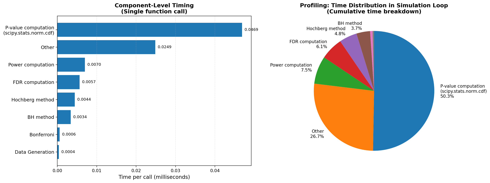
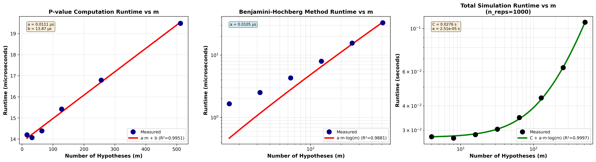

# Baseline Analysis

## 1. Total Runtime of Simulation Study

The complete simulation study executed with the following parameters:

- **m values**: [4, 8, 16, 32, 64] (number of hypotheses)
- **Null proportions**: [0.75, 0.50, 0.25, 0.0]
- **Distributions**: ['D', 'E', 'I'] (3 alternative distributions)
- **Replications**: 20,000 per configuration

**Total runtime: 36.1698046250 seconds**

---

## 2. Profiler Results:

### Profiling Configuration

Profiling was performed using `cProfile` on a baseline simulation:
- m = 32 hypotheses
- n_reps = 1,000 replications
- Tool: `baseline_profile.py`

### Component-Level Timing (per single replication)

| Component | Time (ms) | Percentage |
|-----------|-----------|------------|
| **P-value computation (scipy.stats.norm.cdf)** | 0.0522 | 50.0% |
| Other operations | 0.0281 | 26.9% |
| Power computation | 0.0076 | 7.3% |
| FDR computation | 0.0060 | 5.8% |
| Hochberg method | 0.0053 | 5.0% |
| BH method | 0.0040 | 3.9% |
| Data Generation | 0.0006 | <1% |
| Bonferroni | 0.0006 | <1% |

### Key Findings

1. **Dominant Bottleneck: P-value Computation**
   - 50% of total runtime
   - Implementation: `2 * (1 - stats.norm.cdf(np.abs(test_statistic)))`

2. **Secondary Contributors**
   - "Other" operations (26.9%): Array operations, indexing, loop overhead
   - Performance metrics (Power + FDR): 13.1% combined
   - Multiple testing procedures (Bonferroni/Hochberg/BH): 8.9% combined

3. **Fast Operations**
   - Sorting-based methods (Hochberg/BH) are highly optimized by NumPy

### Visualization

- **Left**: Per-call timing for each component
- **Right**: Cumulative time distribution across all components

---

## 3. Computational Complexity Analysis

We analyze the component complexity of: `compute_pvalues`, `benjamini_hochberg_method`, and a single run.

### Theoretical Complexity

| Component | Complexity | Reasoning |
|-----------|------------|-----------|
| `compute_pvalues` | O(m) | Vectorized operation for each m value |
| `benjamini_hochberg_method` | **O(m log m)** | Sort p-values + backward loop |
| **Single replication** | **O(m log m)** | Dominated by sorting operations |

### Empirical Complexity: 

Fitted Model for  `compute_pvalues`: `time = a·m + b`

Fitted Model for  `benjamini_hochberg_method`: `time = a·m·log(m)`

Fitted Model for single run: `time = C + a·m·log(m)`

---

## 4. Numerical Warnings and Convergence Issues

Under current simulation settings, all generated values stay in the good range that machine can handle perfectly, and the related statistical methods mostly uses sorting and comparisons, which are already well-optimized. No numerical or convergence issues observed.