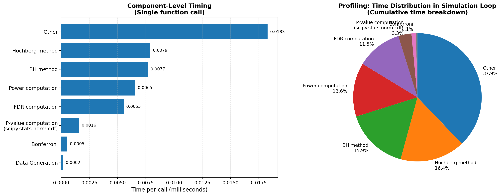

# Optimization Report


---

## 1. Algorithmic Improvements

### 1.1 P-value Computation: (50% of runtime before)
**Original implementation:**
```python
from scipy import stats
pvalues = 2 * (1 - stats.norm.cdf(np.abs(test_statistic)))
```

The `stats.norm.cdf()` function is a high-level interface, which takes more time.

**Improvement:**
```python
# Lower-level C implementation
from scipy.special import ndtr  # Low-level C function
pvalues = 2 * (1 - ndtr(np.abs(test_statistic)))
```

**Trade-offs:**
- less readability
- limited for standard normal distribution: only works for $N(0,1)$, cannot handle non-standard situations
- no input check, less stable than `stats.norm.cdf()` 

---

### 1.2 Generate Alternative Means: Eliminated Python List Operations

**Original implementation:**
```python
# Python list operations
means = []
for level, count in zip(levels, counts):
    means.extend([level] * count)
means = np.array(means)
```

**Solution:**
```python
# Direct NumPy operation
means = np.repeat(levels, counts)
```

**Benefits:**
- **Eliminated list overhead:** No Python list allocation/extension
- **Less memory fragmentation:** Direct array creation

**Trade-offs:**
- less readability(?)

---

## 2. Array Programming
### 2.1 Hochberg Method: Backward Loop

**Original implementation:**
```python
for i in range(m, 0, -1):
    if sorted_pvalues[i-1] <= alpha / (m + 1 - i):
        k = i
        break
```

The backwards loop iterates through all m hypotheses, making this O(m) after the O(m log m) sort.

**Improvement:**
```python

i_values = np.arange(1, m + 1)
thresholds = alpha / (m + 1 - i_values)
valid = sorted_pvalues <= thresholds  # Vectorized comparison

if np.any(valid):
    k = np.max(np.where(valid)[0]) + 1
else:
    k = 0
```


### 2.2 Benjamini-Hochberg Method: Backward Loop


**Original implementation:**
```python
for i in range(m, 0, -1):
    if sorted_pvalues[i-1] <= (i / m) * q:
        k = i
        break
```

**Improvement:**
```python
i_values = np.arange(1, m + 1)
thresholds = (i_values / m) * q
valid = sorted_pvalues <= thresholds  # Vectorized comparison

if np.any(valid):
    k = np.max(np.where(valid)[0]) + 1
else:
    k = 0
```


---

## 3. Numerical Stability

### 3.1 Extreme p value computation - use log scale

(not implemented in the simulation, because under the original setting, the current method is very stable; and usually we don't have such extreme p-values)

**Improved Version:**
```python
# Lower-level C implementation
from scipy.special import ndtr  # Low-level C function
pvalues = 2 * (1 - ndtr(np.abs(test_statistic)))
```

**Improved Version with Better Numerical Stability:**
```python
# use log-version
from scipy.special import log_ndtr
abs_z = np.abs(test_statistic)
# use log-space to avoid underflow
log_p_upper = log_ndtr(-abs_z)  # log(P(Z > |z|))
log_pvalues = log_p_upper + np.log(2)  # log(2 * P(Z > |z|))
pvalues = np.exp(log_pvalues) # or we can just use log-scale p-value for further computation
```
---
### 3.2 Computational Stability

Generally we can implement LogSumExp trick to make key steps more stable; but in this implementation, it's mainly about comparison and simple additive operations, thus not implemented.

---

## 4. Performance Impact
### Single Operation Performance


- **Up left**: p-value computation comparison
- **Up right**: alternative means generation comparison
- **Down left**: Hochberg method comparison
- **Down right**: Benjamini-Hochberg method comparison

### Overall Profiling (without configuration parallelization)
**Single Replication Performance Comparison**



The two figures show the profiling results for the single replication: the above one is the original version, and the second plot is the optimized one.

The vectorized Hochberge and BH method are slower, because the total number of hypothesis is small here($m=32$). The new function of p-value comparison speeds up significantly.

## **Full Simulation Runtime**
**Total runtime before: 36.1698046250 seconds**
**Total runtime after: 27.4839101251 seconds**

However, the overall improvement for the full simulation is not satisfactory.

## 5. Parallelization

Note that at each configuration, the simulation runs 20,000 replications sequentially, and we have in total 60 independent configurations ($5 \text{m values} \times 4 \text{null proportions} \times 3 \text{distributions}$). So we can consider parallelize 60 configurations across CPUs.

```python
# simulation_parallel.py
# Prepare all configuration arguments for parallel execution
config_args = []
for m in m_values:
    base_data = base_data_cache[m]
    for null_prop in null_proportions:
        for dist in distributions:
            config_args.append((
                m, null_prop, dist, base_data,
                base_seed, L_setting, alpha_setting, n_reps
            ))

total = len(config_args)
print(f"\n Running {total} configurations in parallel...")

# Run all configurations in parallel across CPUs
with Pool(processes=n_cpus) as pool:
    results_list = list(tqdm(
        pool.imap_unordered(run_single_configuration, config_args),
            total=total,
            desc="Simulations",
            ncols=80
        ))
```

**Total time: 5.9518945001 seconds** - Significant Speed up

## 6. Summary - lessons learned
- **p-value computation: lower level function implementation:** didn't expected that `stats.norm.cdf` was the most time-consuming function in single replication, and replacing it with lower level functions worked really well. We discussed about directly using C/C++ code in some computational bottlenecks at STATS 810, and at that time I thought I would hardly ever choose this approach. Now I really realized that it helped a lot, and could be of relatively low efforts.

- **Vectorization:** it always helps a lot, but for this simulation, since we are using relatively small vectors, so it is not help speeding up, but I will always try to vectorize the code.

- **Parallelization:** Very effective for this simulation, and is surprisingly easy.

## 7. Test

can be found in `test_regression.py`